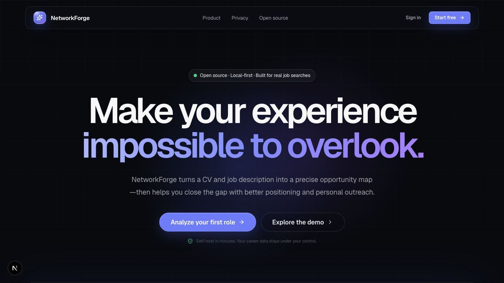
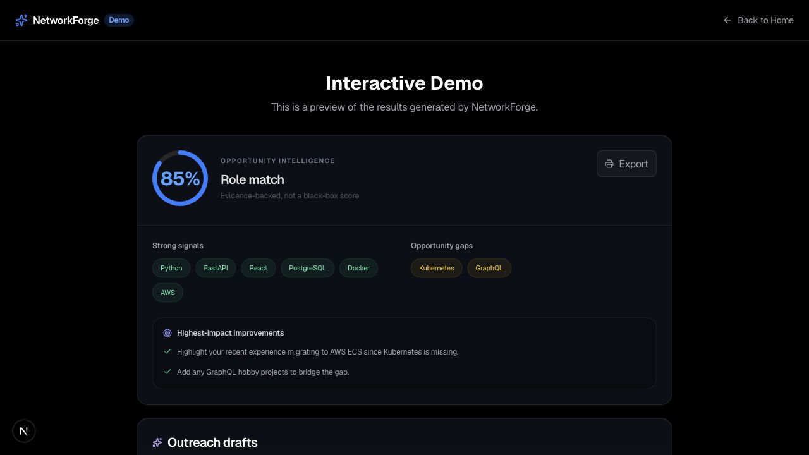
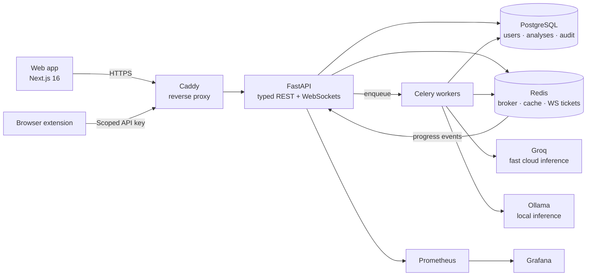
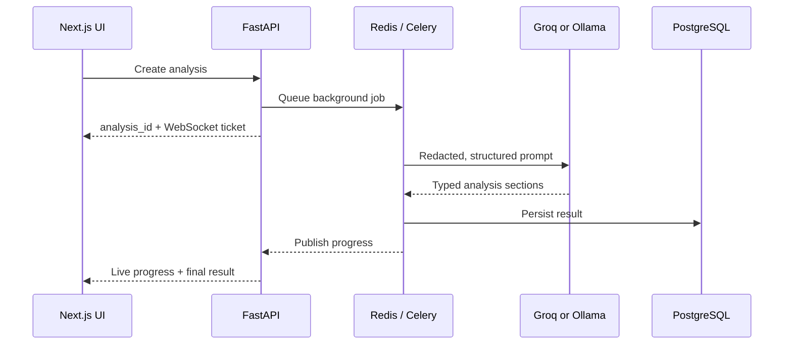

<div align="center">


# NetworkForge

### Make your experience impossible to overlook.

**The open-source, privacy-first career intelligence platform that turns a CV and job description into an explainable opportunity map, sharper positioning, and personal recruiter outreach.**

<p>
  <a href="https://github.com/ardamoustafa1/NetworkForge/actions/workflows/ci.yml"></a>
  <a href="LICENSE"></a>
  <a href="https://github.com/ardamoustafa1/NetworkForge/stargazers"></a>
  <a href="https://github.com/ardamoustafa1/NetworkForge/issues"></a>
  
  
</p>

<p>
  <a href="#-quick-start"><strong>Quick start</strong></a>
  ·
  <a href="#-how-it-works"><strong>How it works</strong></a>
  ·
  <a href="#-architecture"><strong>Architecture</strong></a>
  ·
  <a href="CONTRIBUTING.md"><strong>Contribute</strong></a>
</p>

</div>



---

## The problem

Most career AI tools give you a mysterious score, rewrite your résumé into generic sludge, and ask you to trust a cloud service with your professional history.

NetworkForge takes a different route:

- **Evidence before vibes.** Skills are extracted first; the score is calculated from inspectable signals.
- **Guidance before generation.** You see the gaps and highest-impact improvements before receiving any draft.
- **Your voice before AI voice.** Outreach is grounded in your actual experience and remains fully editable.
- **Privacy before convenience.** Personal identifiers are redacted before cloud inference—or inference stays local with Ollama.

> NetworkForge is not an auto-apply bot. It is a decision and positioning layer for thoughtful job searches.

## ✦ What you get

| Opportunity intelligence | Personal positioning | Private infrastructure |
|---|---|---|
| Explainable 0–100 role match | CV improvement priorities | Local Ollama inference |
| Matched and missing skills | Recruiter connection note | PII redaction pipeline |
| Evidence-backed gap analysis | First contact + follow-up drafts | Self-hosted data ownership |
| Analysis history and trends | Profile headline and About draft | Revocable extension API keys |



## Why developers choose NetworkForge

```text
CV + target role
       ↓
structured signals
       ↓
deterministic match
       ↓
clear improvements
       ↓
human-reviewed outreach
```

- **Provider freedom:** use Groq for fast cloud inference or Ollama for a local-only path.
- **Real-time workflow:** background analysis with WebSocket progress and polling fallback.
- **Built for extension:** analyze job posts through the included browser extension.
- **Production-minded:** PostgreSQL, Redis, Celery, Caddy, Prometheus, Grafana, typed APIs, and automated tests.
- **Multilingual output:** generate outreach in English, Turkish, Spanish, French, or German.
- **Portable by design:** one Docker Compose stack, no proprietary runtime.

## ⚡ Quick start

### Requirements

- Docker with Docker Compose
- 4 GB+ free memory
- Optional: a [Groq API key](https://console.groq.com/keys) for fast cloud inference

### Run the complete stack

```bash
git clone https://github.com/ardamoustafa1/NetworkForge.git
cd NetworkForge

cp .env.example .env
docker compose up --build
```

Open:

- **Product:** [http://localhost:3000](http://localhost:3000)
- **API docs:** [http://localhost:8000/docs](http://localhost:8000/docs)
- **Grafana:** [http://localhost:3001](http://localhost:3001)
- **Prometheus:** [http://localhost:9090](http://localhost:9090)

For the local Ollama path, pull the configured model once:

```bash
docker compose exec ollama ollama pull llama3:8b
```

For Groq, add this to `.env`:

```dotenv
GROQ_API_KEY=gsk_your_key
GROQ_MODEL=llama-3.3-70b-versatile
```

## ◎ How it works

1. **Ingest** — Paste a CV and job description, or upload a PDF/image.
2. **Protect** — Validate files and redact common personal identifiers.
3. **Extract** — Convert both documents into structured skills and experience signals.
4. **Score** — Calculate an explainable fit score instead of asking an LLM to invent one.
5. **Position** — Identify the most valuable CV and profile improvements.
6. **Connect** — Draft editable, source-grounded recruiter outreach.

## ⌘ Architecture



### Request lifecycle



| Layer | Technology | Responsibility |
|---|---|---|
| Experience | Next.js 16, React 19, Tailwind CSS 4, Framer Motion | Product UI, authentication, analysis workspace |
| API | FastAPI, Pydantic, asyncpg | Auth, uploads, analyses, API keys, WebSockets |
| Jobs | Celery, Redis | Durable background inference and progress events |
| Data | PostgreSQL 16 | Users, sessions, analyses, audit records |
| Intelligence | Groq, Ollama | Structured extraction and grounded generation |
| Edge | Caddy | TLS, routing, security headers |
| Observability | Prometheus, Grafana, OpenTelemetry | Metrics, dashboards, production visibility |

Read the deeper technical guide in [docs/architecture.md](docs/architecture.md).

## 🔐 Privacy and security

Career data deserves the same care as financial data.

- Common email addresses and phone numbers are masked before cloud model calls.
- Ollama offers a fully local inference route.
- Authentication uses secure HTTP-only cookies.
- Passwords use Argon2 hashing.
- Optional TOTP multi-factor authentication is built in.
- Uploads enforce type, size, PDF page, and image pixel limits.
- Extension credentials are scoped, hashed, expiring, and revocable.
- Users can export or permanently delete their data.

See [SECURITY.md](SECURITY.md), [THREAT_MODEL.md](THREAT_MODEL.md), and the [ASVS checklist](ASVS_CHECKLIST.md).

> No system can promise absolute privacy. Review your provider configuration and deployment environment before processing sensitive documents.

## 🧰 Developer workflow

```bash
# Backend and frontend tests
make test

# Ruff, mypy, ESLint, TypeScript, and extension checks
make lint

# Production builds
make build

# The complete local quality gate
make qa
```

Useful commands:

```bash
make dev        # start the development stack
make logs       # follow API, worker, and frontend logs
make migrate    # apply database migrations
make extension  # package the browser extension
make down       # stop the stack
```

## 🗺 Roadmap

- [x] Explainable skill matching and gap analysis
- [x] Editable outreach and profile positioning
- [x] Groq and local Ollama providers
- [x] Browser extension with revocable API keys
- [x] Real-time analysis progress
- [x] MFA, data export, and account deletion
- [x] Prometheus and Grafana observability
- [ ] Side-by-side CV version comparison
- [ ] Pluggable extraction and scoring strategies
- [ ] Community provider adapters
- [ ] Team workspaces for career coaches

Have a strong opinion about what should come next? [Start a discussion](https://github.com/ardamoustafa1/NetworkForge/discussions).

## Contributing

Small fixes, new providers, scoring ideas, accessibility improvements, and translations are all welcome.

1. Read [CONTRIBUTING.md](CONTRIBUTING.md).
2. Pick an issue—or open one before a large change.
3. Run `make qa`.
4. Open a focused pull request with screenshots for UI work.

Please follow the [Code of Conduct](CODE_OF_CONDUCT.md).

## License

NetworkForge is available under the [MIT License](LICENSE).

---

<div align="center">

**If NetworkForge gives you an edge, give the project a star. It helps the right people find it.**

[⭐ Star NetworkForge](https://github.com/ardamoustafa1/NetworkForge) · [🐛 Report a bug](https://github.com/ardamoustafa1/NetworkForge/issues) · [💡 Request a feature](https://github.com/ardamoustafa1/NetworkForge/issues/new)

</div>
