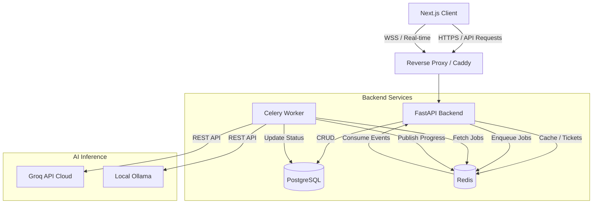

# NetworkForge Architecture

This document outlines the high-level architecture and data flow of NetworkForge.

## System Diagram

## Core Components

### 1. Next.js Frontend
- Uses React 19 and Next.js 14 App Router.
- State management via Zustand.
- Forms the UI for uploading CVs, managing JD texts, and viewing results.
- Uses `window.print()` for native PDF exports.

### 2. FastAPI Backend
- Strictly typed REST API with Pydantic schemas.
- WebSocket support for real-time progress updates.
- Scoped authentication via JWTs and API Keys (used by the Chrome Extension).

### 3. PostgreSQL Database
- Stores users, sessions, analyses, and audit logs.
- Accessed asynchronously using `asyncpg` for maximum throughput.

### 4. Celery Worker & Redis
- Redis acts as the message broker for Celery.
- Background tasks perform long-running AI inference without blocking the HTTP threads.
- Redis is also used for caching ephemeral WebSocket tickets to prevent CSRF.

### 5. AI Engine
- Implements a deterministic scoring fallback.
- Uses strict JSON extraction via Tenacity retries.
- Masks PII (Emails, Phones) before sending data to LLMs.
